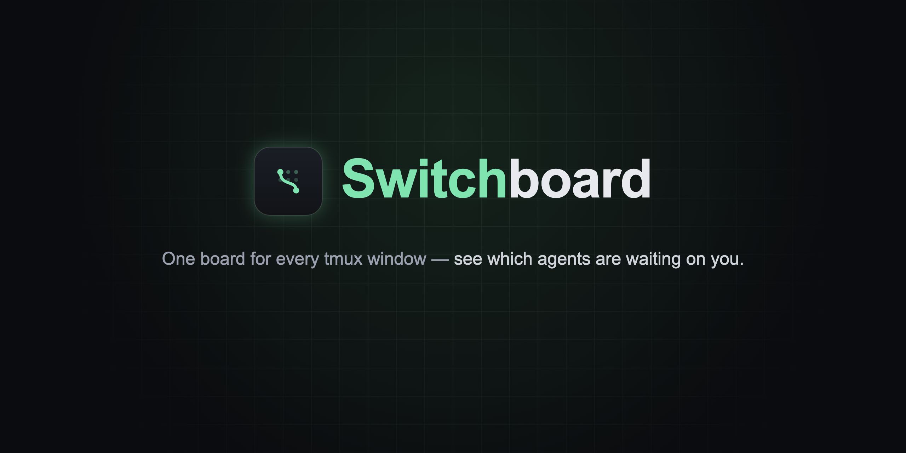
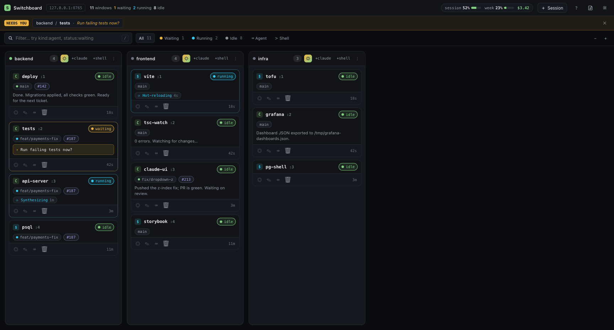
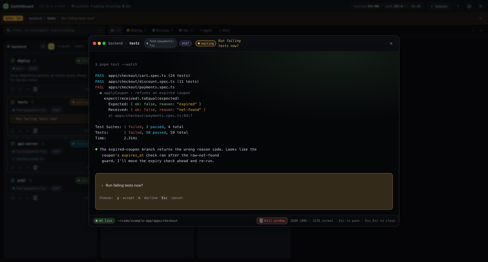
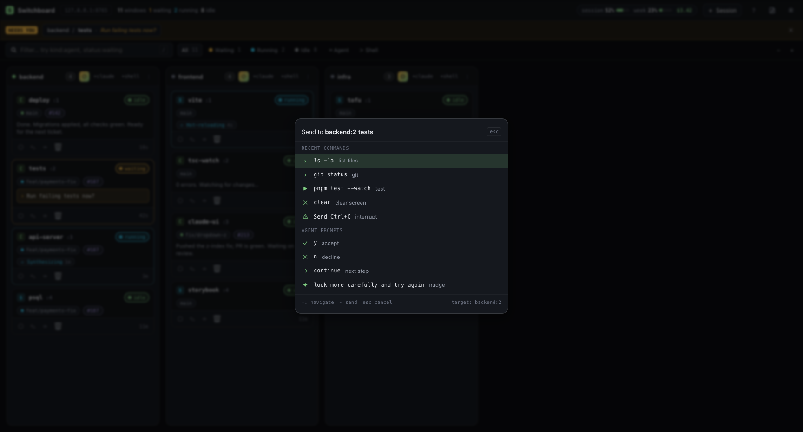
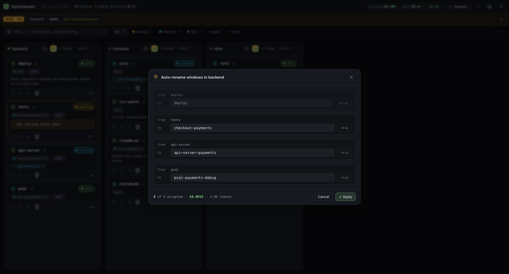
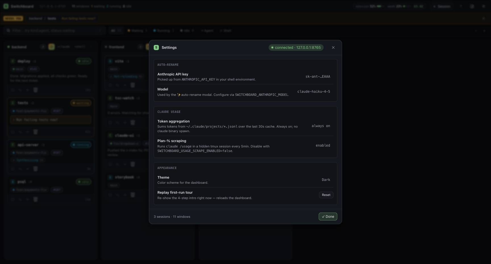
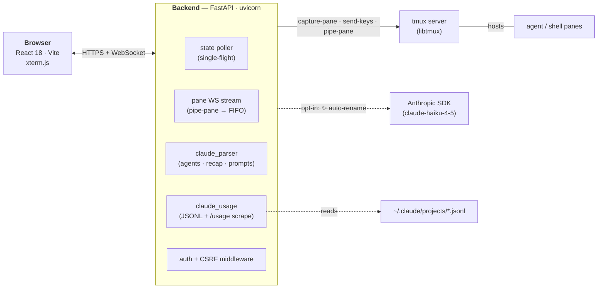

<p align="center">
  
</p>

<p align="center">
  <a href="#install"></a>
  <a href="#"></a>
  <a href="#"></a>
  <a href="LICENSE"></a>
</p>



Live browser dashboard for tmux sessions. Every tmux window becomes a card; clicking a card opens a live xterm.js-style modal bridged over WebSocket. Parses Claude Code agent panes to surface branch, PR, CI status, spinner, recap, and pending input — so a wall of running agents is glanceable instead of a tab fight.

## Features

- **Kanban view** of every tmux pane — sessions become columns, windows become cards, status colors at a glance
- **Claude Code detection** — branch + PR chip, CI rollup, spinner with elapsed, recap of last assistant line, and a "waiting on you" badge when an agent prompts
- **Live terminal modal** powered by xterm.js with WebSocket auto-reconnect ([THI-117](https://linear.app/thibault-dody/issue/THI-117)), buffer paste + image paste ([THI-116](https://linear.app/thibault-dody/issue/THI-116))
- **Browser notifications + favicon dot** when any agent flips to waiting ([THI-78](https://linear.app/thibault-dody/issue/THI-78))
- **⌘K command palette** — send keys to the focused pane from anywhere on the dashboard
- **Clickable file paths → IDE** and **PR chips → GitHub** inside terminal output ([THI-146](https://linear.app/thibault-dody/issue/THI-146))
- **✨ Auto-rename** — Anthropic Haiku suggests names for every window in a session, preview/edit/skip per row before applying ([THI-67](https://linear.app/thibault-dody/issue/THI-67))
- **Claude usage pill** — rolling-window token totals + plan-% scraping ([THI-110](https://linear.app/thibault-dody/issue/THI-110))
- **Drag to reorder** columns and tiles within a column ([THI-115](https://linear.app/thibault-dody/issue/THI-115) / [THI-141](https://linear.app/thibault-dody/issue/THI-141))
- **Four themes** — dark / light / high-contrast / phosphor — every interactive surface clears WCAG AA contrast ([THI-149](https://linear.app/thibault-dody/issue/THI-149) and follow-ups)
- **First-run tour**, replayable from Settings ([THI-96](https://linear.app/thibault-dody/issue/THI-96))

## Screenshots

<table>
  <tr>
    <td><a href="docs/screenshots/02-terminal-modal.png"></a><br/><em>Live terminal modal — xterm.js over WebSocket, with the agent's pending prompt overlaid</em></td>
    <td><a href="docs/screenshots/03-command-palette.png"></a><br/><em>⌘K command palette — send keys to the focused pane</em></td>
  </tr>
  <tr>
    <td><a href="docs/screenshots/04-auto-rename.png"></a><br/><em>✨ Auto-rename — Haiku suggestions, preview/edit per row</em></td>
    <td><a href="docs/screenshots/05-settings.png"></a><br/><em>Settings — appearance, polling, auto-rename + Claude usage knobs</em></td>
  </tr>
</table>

## Quickstart

```bash
# 1. Install backend deps (uses uv)
cd backend && uv sync && cd ..

# 2. Install frontend deps
cd frontend && npm install && cd ..

# 3. (one-time, per clone) Enable the pre-push hook
git config core.hooksPath scripts/hooks

# 4. Run both servers (backend :8765, frontend :5173)
./scripts/dev.sh

# 5. (optional) Seed a multi-session / multi-window tmux server for local testing
./scripts/seed-tmux.sh
```

Open <http://localhost:5173>.

The pre-push hook runs the same gates as CI (ruff format/check, ty, pytest, tsc, vitest, vite build, WCAG contrast audit) before any `git push`. Skip with `git push --no-verify` for emergencies.

## Configuration

All env vars are prefixed `SWITCHBOARD_` and read from the launch environment or a `backend/.env` file (`pydantic-settings`).

| Variable | Default | Purpose |
| --- | --- | --- |
| `SWITCHBOARD_HOST` | `127.0.0.1` | Bind address. Anything off-loopback flips on auth automatically. |
| `SWITCHBOARD_PORT` | `8765` | Backend port. The frontend dev server defaults to `5173`. |
| `SWITCHBOARD_AUTH_REQUIRED` | (auto) | Force auth on/off — overrides the loopback heuristic. |
| `SWITCHBOARD_ANTHROPIC_API_KEY` | (none) | Enables ✨ auto-rename. Falls back to the standard `ANTHROPIC_API_KEY`. |
| `SWITCHBOARD_ANTHROPIC_MODEL` | `claude-haiku-4-5` | Model used by auto-rename. |
| `SWITCHBOARD_ANTHROPIC_CAPTURE_LINES` | `80` | How much pane scrollback to feed the model per window. |
| `SWITCHBOARD_CLAUDE_PROJECTS_DIR` | `~/.claude/projects` | Where Claude Code writes JSONL session logs, sourced for the usage pill. |
| `SWITCHBOARD_USAGE_SCRAPE_ENABLED` | `true` | Toggle the periodic `claude /usage` scrape (plan-% meters). |
| `SWITCHBOARD_IDE_CMD` | `code` | Editor binary launched for clicked file paths. Must be on the GUI allowlist (`code-insiders`, `cursor`, `subl`, `idea`, `pycharm`, `webstorm`, `rubymine`, `goland`, `rider`, `clion`, `phpstorm`). |
| `SWITCHBOARD_PANE_CAPTURE_LINES` | `200` | Lines fetched per `capture-pane` for parser + previews. |
| `SWITCHBOARD_PASTE_IMAGE_MAX_BYTES` | `10 MiB` | Cap on `/api/paste-image` uploads. |

## Security model

Switchboard can read your panes and inject keystrokes — treat the endpoint like a shell.

**Loopback mode (default).** Bound to `127.0.0.1`, so only processes on your machine can reach it. No token required — zero friction. Two protections still apply: the `Host` header must match a loopback allowlist (defeats DNS-rebinding from a malicious web page), and mutating requests need a double-submit CSRF cookie+header.

**Exposed mode.** If you bind to a non-loopback host (`SWITCHBOARD_HOST=0.0.0.0`, a LAN IP, etc.) auth turns on automatically. A random token is generated on first run and stored at `~/.switchboard/token` (mode `0600`). On startup the console prints a bootstrap URL — `http://host:port/?token=…` — open it once and the backend swaps the token for an `HttpOnly` session cookie. API clients can alternatively send `Authorization: Bearer <token>`.

Override the auto-detection with `SWITCHBOARD_AUTH_REQUIRED=true|false`. Rotate the token via `POST /api/auth/regenerate` (this invalidates existing session cookies).

## Architecture



- **Frontend** — single-page React app served by Vite in dev, a static bundle behind any reverse proxy in prod. Live state polled at an adaptive interval (faster while a modal is open or an agent is waiting); pane bytes stream over a per-pane WebSocket.
- **Backend** — FastAPI app. State is a single-flight `tmux ls`/`list-windows`/`list-panes` pass parsed into typed Pydantic models. Pane streaming uses `tmux pipe-pane` into a FIFO and forwards bytes to the WS; reconnects re-attach to the same FIFO without losing scrollback.
- **Agent detection** — `services/claude_parser.py` reads the last ~200 lines of each pane, finds spinner glyphs, the `⏺`/`●` recap marker, prompt boxes, and free-form open questions like `Should I commit?` ([THI-148](https://linear.app/thibault-dody/issue/THI-148)). No Claude binary required.
- **Auto-rename** — `services/anthropic_client.py` is lazy-imported so the server boots without a key. `/api/auto-rename/*` returns `503` when disabled, and the frontend hides the ✨ button.

## Layout

```
backend/                        FastAPI + libtmux service (uv-managed)
  src/switchboard/
    routers/                    HTTP + WS endpoints
    services/                   tmux, claude_parser, claude_usage, anthropic_client, pane_stream
    config.py / schemas.py / main.py / security.py / auth.py
  tests/                        pytest (~280 tests)
frontend/                       React 18 + TypeScript + Vite SPA
  src/
    components/                 WindowCard, Kanban, TerminalModal, DocsModal, AutoRenameModal, …
    components/docs/            in-app docs diagrams (callouts)
    lib/                        settings, filter, status, xtermThemes, xtermStreamRewriter, …
    api/                        client + polling
  vitest                        (~370 tests)
scripts/
  dev.sh                        launches both servers in tmux panes
  seed-tmux.sh                  populates a multi-session tmux server for local UI work
  hooks/                        pre-push hook (CI gates locally)
  a11y/contrast_audit.py        per-theme WCAG audit, also wired into CI
  screenshots/capture.ts        README capture script (Playwright + tsx)
docs/
  screenshots/                  README hero shots
  a11y/screenshots/             a11y review captures (light + dark)
  superpowers/                  per-ticket spec + plan notes
  design-reference/             original design handoff (prototype JSX + styles.css)
```

## Development

```bash
# Backend
cd backend
uv run pytest                                  # ~280 tests
uv run ruff format --check . && uv run ruff check . && uvx ty check

# Frontend
cd frontend
npm run typecheck && npm run test && npm run build

# WCAG contrast audit
python3 scripts/a11y/contrast_audit.py --check-sync
python3 scripts/a11y/contrast_audit.py --rule focus --rule hover --rule disabled --rule selection --quiet

# Regenerate README screenshots (requires both dev servers running on localhost)
cd frontend && npx tsx ../scripts/screenshots/capture.ts
```

CI runs the same gates on every push (`.github/workflows/ci.yml`).

## License

MIT. See [`LICENSE`](LICENSE).
